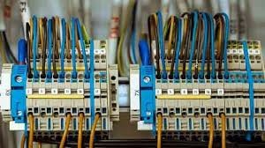
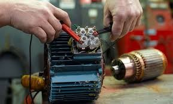
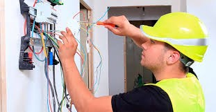

<html lang="es">

<head>
    <meta charset="UTF-8">
    <meta name="viewport" content="width=device-width, initial-scale=1.0">
    <title>Servicios Eléctricos Industriales</title>

    <!-- Bootstrap CSS -->
    <link href="https://cdn.jsdelivr.net/npm/bootstrap@5.3.2/dist/css/bootstrap.min.css" rel="stylesheet">

    <!-- Iconos de Bootstrap -->
    <link href="https://cdn.jsdelivr.net/npm/bootstrap-icons/font/bootstrap-icons.css" rel="stylesheet">

    
</head>

<body>
    <header class="text-center">
        <h1>Servicios Eléctricos Industriales en Guatemala</h1>
        <h3>Especialista en mantenimiento, instalaciones y diagnósticos eléctricos</h3>
        <nav class="mt-3">
            <a href="#servicios" class="btn btn-warning mx-2">Servicios</a>
            <a href="#contacto" class="btn btn-warning mx-2">Contacto</a>
        </nav>
    </header>

    <main class="container my-5">
        <!-- Sección de Servicios -->
        <section id="servicios" class="mb-5">
            <h2 class="text-center mb-4">Nuestros Servicios</h2>
            

                

                    

                        
                        

                            <h5 class="card-title">Instalación Eléctrica Industrial</h5>
                            
Precio estimado: Q800 - Q1500

                        

                    

                

                

                    

                        
                        

                            <h5 class="card-title">Mantenimiento de Motores Eléctricos</h5>
                            
Precio estimado: Q500 - Q1200

                        

                    

                

                

                    

                        
                        

                            <h5 class="card-title">Diagnóstico de Fallas</h5>
                            
Precio estimado: Q400 - Q700

                        

                    

                

                

                    

                        
                        

                            <h5 class="card-title">Reparaciones Generales</h5>
                            
Precio estimado: Q300 - Q1000

                        

                    

                

            

        </section>

        <!-- Sección de Contacto -->
        <section id="contacto" class="mb-5">
            <h2 class="text-center mb-4">Contáctanos</h2>
            
EMERGENCIA LAS 24 HORAS

            <form class="mx-auto" style="max-width: 600px;" onsubmit="sendToWhatsApp(event)">
                

                    <label for="name" class="form-label">Nombre Completo</label>
                    <input type="text" id="name" class="form-control" placeholder="Tu nombre" required>
                

                

                    <label for="email" class="form-label">Correo Electrónico</label>
                    <input type="email" id="email" class="form-control" placeholder="Tu correo" required>
                

                

                    <label for="message" class="form-label">Mensaje</label>
                    <textarea id="message" class="form-control" placeholder="Tu mensaje" rows="5" required></textarea>
                

                

                    <button type="button" class="btn btn-light">Enviar</button>
                

            </form>
        </section>
    </main>

    <!-- Pie de página -->
    <footer class="text-center">
        
&copy; 2024 Servicios Eléctricos Industriales. Todos los derechos reservados.

        
Síguenos en nuestras redes sociales:

        <a href="#" class="social-icon"><i class="bi bi-facebook"></i></a>
        <a href="#" class="social-icon"><i class="bi bi-instagram"></i></a>
        <a href="#" class="social-icon"><i class="bi bi-whatsapp"></i></a>
    </footer>

    <!-- Bootstrap JS Bundle -->
    

    
</body>

</html>
